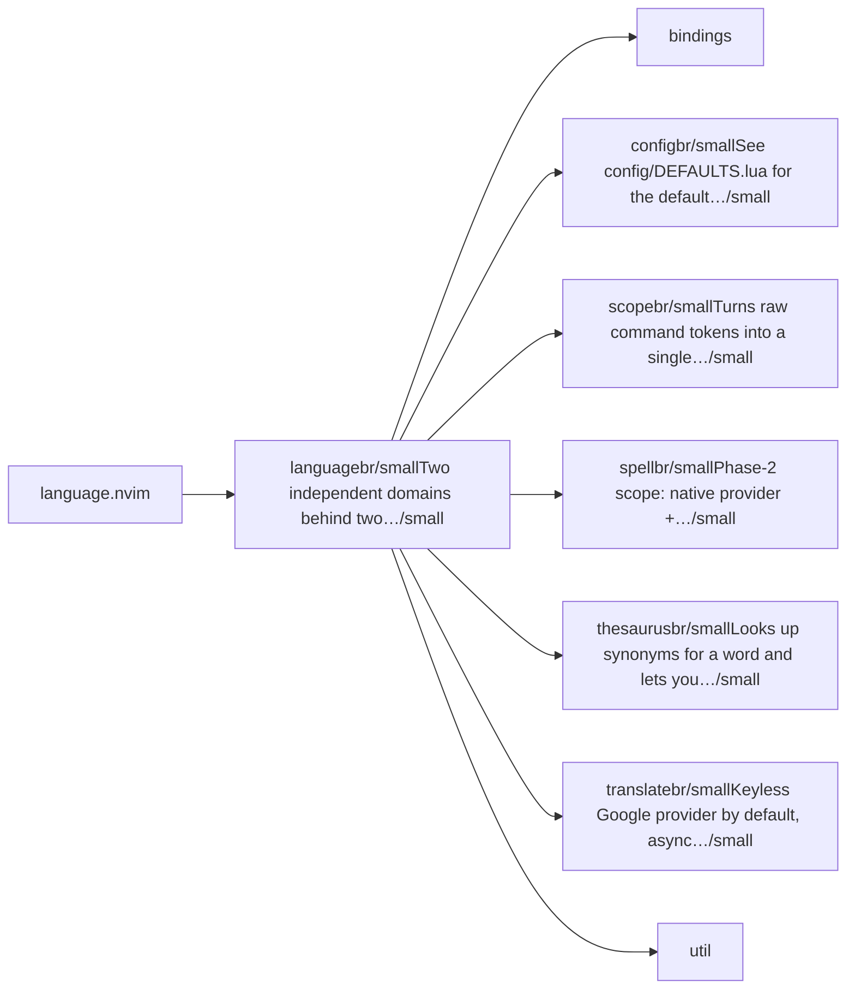
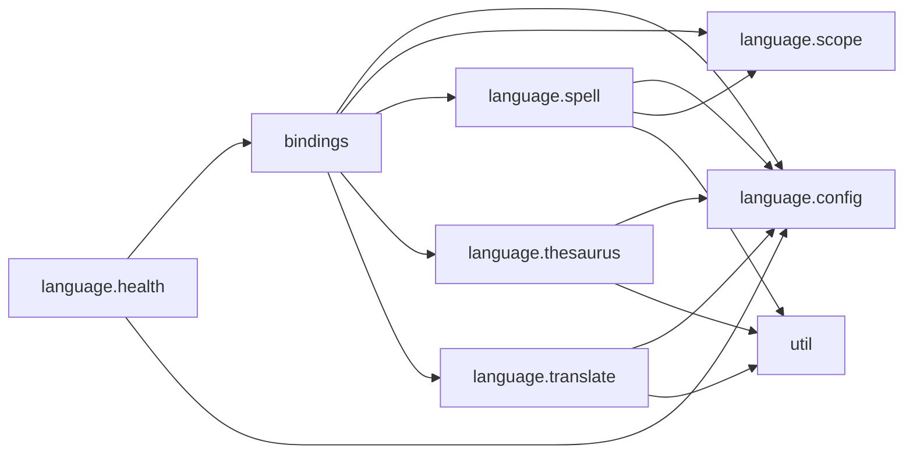

# language.nvim — module map

> **Generated** by `documentation`. Do not edit by hand — run `:DocMap`
> (or `nvim --headless -l scripts/gen_map.lua`) to regenerate.

**12 modules** · 8 namespaces · 35 helper files

The [interactive map](index.html) has filtering, full descriptions and
source links; this page is the version the code host renders directly.

## Namespaces

## Dependencies

Which parts of the tree require which, rolled up to the second level.
The [interactive map](index.html)'s **Deps** view has this per module,
in both directions, with load-time and lazy requires told apart.

## Modules

| Module | Description | Fns | Docs |
|---|---|---|---|
| `language` | Two independent domains behind two top-level commands: :Spellcheck [lang] [buffer\|visible\|cwd\|path=
\|clear\|refresh] :Translate <lang> [--nocode]… | 8 | [src](../../lua/language/init.lua) |
| &nbsp;&nbsp;`bindings` |  |  |  |
| &nbsp;&nbsp;&nbsp;&nbsp;`language.bindings.autocmds` | Event-bundled under a single augroup (Zentrale-Prinzipien §1/§4). | 1 | [src](../../lua/language/bindings/autocmds/init.lua) |
| &nbsp;&nbsp;&nbsp;&nbsp;`language.bindings.keymaps` | Global entry points only: toggle the spell panel/session, and (opt-in) translate motion/visual maps. | 2 | [src](../../lua/language/bindings/keymaps/init.lua) |
| &nbsp;&nbsp;&nbsp;&nbsp;`language.bindings.usrcmds` | Each is its own composer verb with a `path = {}` root route (a flat grammar, no subcommand word — same trick pdfport.nvim/replacer.nvim use). | 4 | [src](../../lua/language/bindings/usrcmds/init.lua) |
| &nbsp;&nbsp;&nbsp;&nbsp;`language.bindings.which_key` | which-key is a **soft** dependency: if it is not installed this is a no-op. | 2 | [src](../../lua/language/bindings/which_key/init.lua) |
| &nbsp;&nbsp;`language.config` | See config/DEFAULTS.lua for the default values and config/@types for their types. | 2 | [src](../../lua/language/config/init.lua) |
| &nbsp;&nbsp;`language.scope` | Turns raw command tokens into a single `LanguageScope` object, so no domain module re-derives the target buffer/range/path (Zentrale-Prinzipien §3). | 3 | [src](../../lua/language/scope/init.lua) |
| &nbsp;&nbsp;`language.spell` | Phase-2 scope: native provider + diagnostics + Trouble/quickfix output with functional parity to the prior config/trouble/spell implementation, now… | 15 | [src](../../lua/language/spell/init.lua) |
| &nbsp;&nbsp;&nbsp;&nbsp;`core` |  |  |  |
| &nbsp;&nbsp;&nbsp;&nbsp;`data` |  |  |  |
| &nbsp;&nbsp;&nbsp;&nbsp;`providers` |  |  |  |
| &nbsp;&nbsp;&nbsp;&nbsp;`ui` |  |  |  |
| &nbsp;&nbsp;`language.thesaurus` | Looks up synonyms for a word and lets you replace the word under the cursor with a chosen one. | 5 | [src](../../lua/language/thesaurus/init.lua) |
| &nbsp;&nbsp;`language.translate` | Keyless Google provider by default, async and cancellable, over the shared scope model. | 8 | [src](../../lua/language/translate/init.lua) |
| &nbsp;&nbsp;&nbsp;&nbsp;`language.translate.output` | `popup` (the default) is read-only and non-mutating, shown via `lib.nvim.ui.kit` (hard dependency, matches the rest of the plugin's UI). | 5 | [src](../../lua/language/translate/output/init.lua) |
| &nbsp;&nbsp;&nbsp;&nbsp;`providers` |  |  |  |
| &nbsp;&nbsp;`util` |  |  |  |
| &nbsp;&nbsp;&nbsp;&nbsp;`language.util.job` | Runs an external command from an argv list — never a shell string — so arbitrary user text (translation payloads) cannot be shell-injected or mis-quoted. | 2 | [src](../../lua/language/util/job/init.lua) |

## Drift

0 errors · 12 warnings · 17 info

| Severity | Check | Message |
|---|---|---|
| warn | `dead-see-target` | M.available: @see target 'LanguageSpellProvider' does not resolve to a known module or function |
| warn | `dead-see-target` | M.available: @see target 'LanguageSpellProvider' does not resolve to a known module or function |
| warn | `dead-see-target` | M.available: @see target 'LanguageSpellProvider' does not resolve to a known module or function |
| warn | `dead-see-target` | M.available: @see target 'LanguageSpellProvider' does not resolve to a known module or function |
| warn | `dead-see-target` | M.available: @see target 'LanguageSpellProvider' does not resolve to a known module or function |
| warn | `dead-see-target` | collect_loaded_under: @see target 'scan_tree' does not resolve to a known module or function |
| warn | `dead-see-target` | M.available: @see target 'LanguageSpellProvider' does not resolve to a known module or function |
| warn | `dead-see-target` | M.available: @see target 'LanguageSpellProvider' does not resolve to a known module or function |
| warn | `dead-see-target` | M.available: @see target 'LanguageTranslateProvider' does not resolve to a known module or function |
| warn | `dead-see-target` | M.available: @see target 'LanguageTranslateProvider' does not resolve to a known module or function |
| warn | `dead-see-target` | M.available: @see target 'LanguageTranslateProvider' does not resolve to a known module or function |
| warn | `dead-see-target` | M.available: @see target 'LanguageTranslateProvider' does not resolve to a known module or function |

17 informational findings

| Check | Message |
|---|---|
| `missing-readme` | lua/language has no README.md |
| `missing-readme` | lua/language/bindings/autocmds has no README.md |
| `missing-readme` | lua/language/bindings/keymaps has no README.md |
| `missing-readme` | lua/language/bindings/usrcmds has no README.md |
| `missing-readme` | lua/language/bindings/which_key has no README.md |
| `missing-readme` | lua/language/config has no README.md |
| `missing-readme` | lua/language/scope has no README.md |
| `missing-readme` | lua/language/spell has no README.md |
| `missing-readme` | lua/language/thesaurus has no README.md |
| `missing-readme` | lua/language/translate has no README.md |
| `missing-readme` | lua/language/translate/output has no README.md |
| `missing-readme` | lua/language/util/job has no README.md |
| `unreferenced-module` | language is required by no other file in the tree |
| `unreferenced-module` | language.spell.providers.codespell is required by no other file in the tree |
| `unreferenced-module` | language.spell.providers.cspell is required by no other file in the tree |
| `unreferenced-module` | language.spell.providers.custom is required by no other file in the tree |
| `unreferenced-module` | language.spell.providers.typos is required by no other file in the tree |

